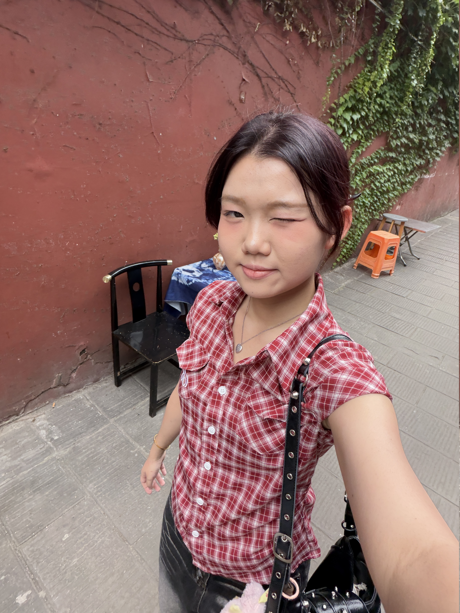
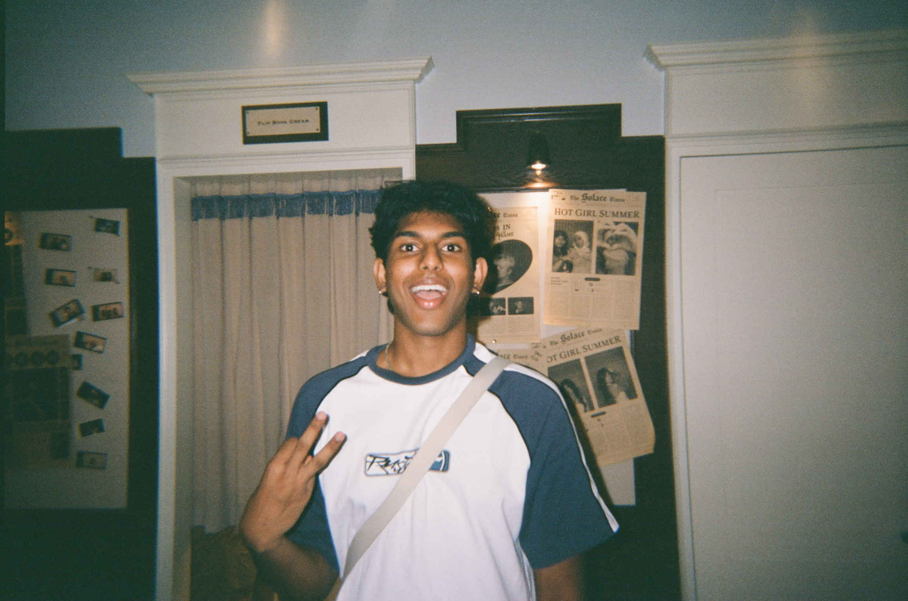
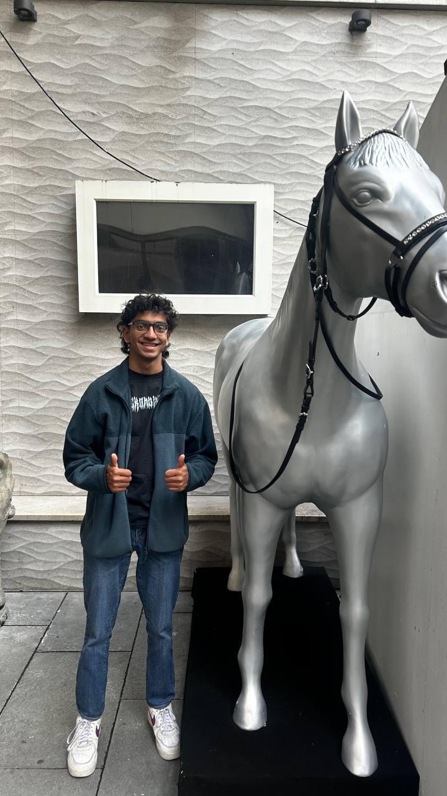

# About Us

We are a team based in the [School of Computing, National University of Singapore](http://www.comp.nus.edu.sg).

You can reach us at the email `seer[at]comp.nus.edu.sg`

## Project team

### Wen Yi Liang

[[github](https://github.com/wenyiliangg)]

* Role: Developer

### Jane Doe

[[github](http://github.com/johndoe)]
[[portfolio](team/johndoe.md)]

* Role: Team Lead
* Responsibilities: UI

### Aaron Leong

[[github](http://github.com/aaronl248)]

* Role: Developer
* Responsibilities: Data

### Laxshan

[[github](http://github.com/Slytherax)]
[[portfolio](*TODO LATER*)]

* Role: Developer
* Responsibilities: Codex Specialist

### Aarav Jayapalan 

[[github](http://github.com/purpleshark74)]
[[portfolio](team/johndoe.md)]

* Role: Developer
* Responsibilities: UI
